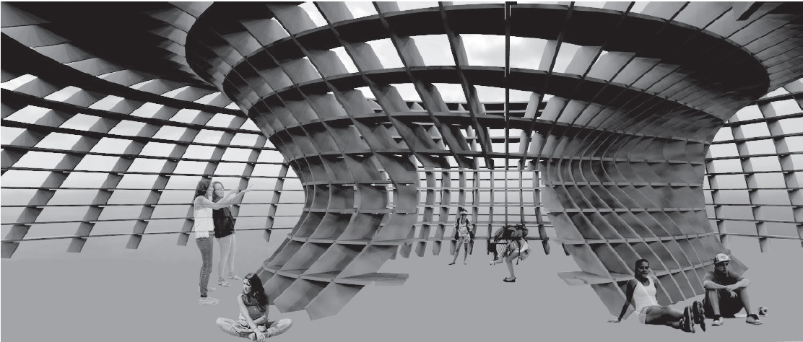
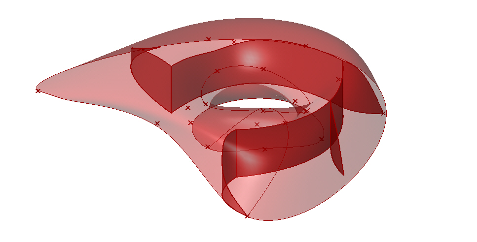
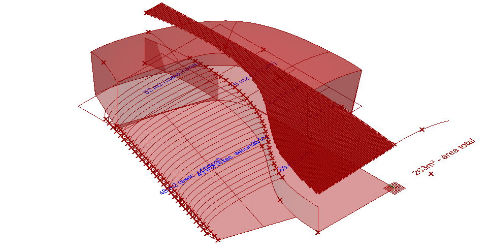
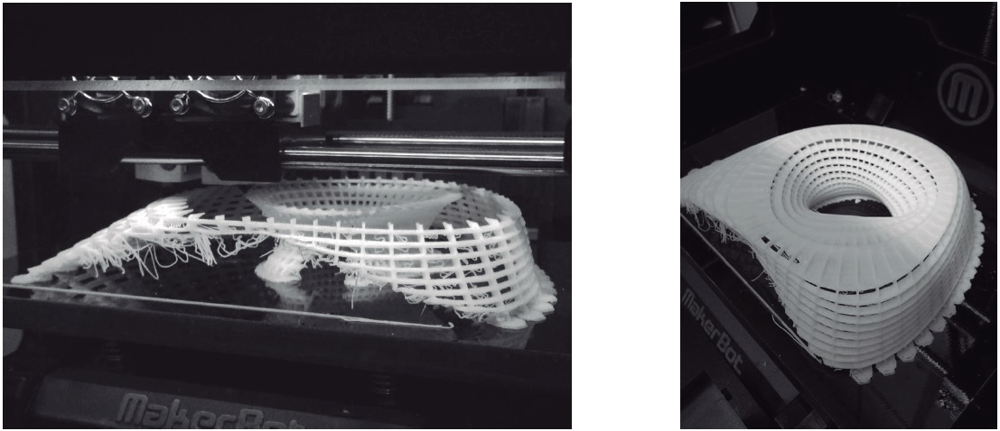

# workshop_parametric_architecture
Workshop Parametric Architecture 2015

The objective of the Workshop, coordinated and taught by professor and architect Rafael Lemieszek Pinheiro, was to discuss the use of collaborative processes in architecture and design, based on a collaborative project experience that took place at the Federal University of Ouro Preto (UFOP), located in the city of Ouro Preto, Brazil.

This experience occurred predominantly using Grasshopper (a parametric plugin for Rhinoceros, a 3D modeling tool) and some of its free addons.

Each member of the academic community was able to contribute to the design according to their level of architectural specialization (ranging from "none", ie students from unrelated courses to "specialist", ie graduate architects).
Each new iteration of design brought new information about which each of the stakeholders could act according to their abilities and expectations.

### Deciding on a program

After the different types of members became aware of the process and began to participate, it was decided to build a shed. Five steps were followed for this:

 - General Needs;
 - Formulation of the Program;
 - Diagrams;
 - Circulation / Sectors / Volumes; and
 - Preliminary Study.
 
### From program to space

The preliminary program was turned into a diagram and roughly drawn in scale using Space Syntax, a complement to the Grasshopper.

### Deciding on a Design

It was agreed by the workshop participants that each phase should observe four types of freedom, inspired by the definition of Free Software and outlined by Fuller and Haque (2008):

> The freedom to run the program for any purpose (freedom 0).
> The freedom to study how the program works and adapt it to your needs (freedom 1).
> The freedom to redistribute copies so you can help your neighbor (freedom 2).
> The freedom to improve the program and release its improvements to the public, so that the whole community benefits (freedom 3).

In the case of the workshop, these freedoms were freely adapted as follows:

 - The freedom to propose any new concept or idea;
 - The freedom to know in detail any concept proposed by any other person;
 - The freedom to adapt and improve any published design at any time;
 - The freedom (and responsibility) to publish any work done in this context, so that anyone else can examine and perfect one's work.

In each phase, the following cycle occurred:

 - Sketches are arranged;
 - Anyone is free to work or perfect any other outline;
 - Each final draft was presented to the community for suggestions;
 - A voting phase was conducted using Facebook (results were not eliminatory);
 - The process has moved on to the next stage.

A final project was not agreed. It was proposed that the two main alternatives be printed in 3D and displayed on the university campus for greater community involvement in the design process.

[Download](https://www.proceedings.blucher.com.br/article-details/collaborative-design-squared-creating-together-the-tools-for-working-together-27694) and read the excellent article written by the workshop coordinator.

